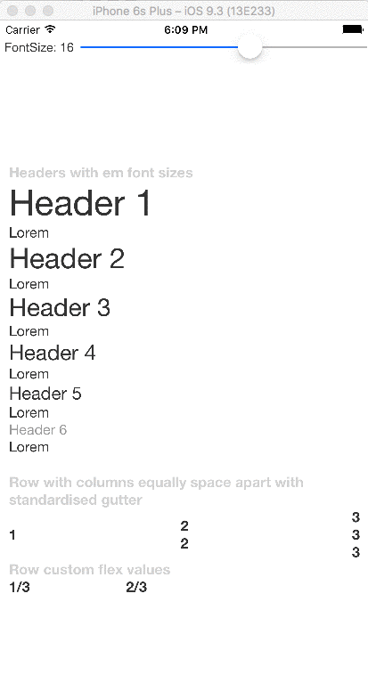

# @phattran1201/rn-kit



###### Having developed and published a large number of react-native applications and boilerplate code, of all the things I can't live without is this set of customisable layout components.

## Usage
- ```yarn add @phattran1201/rn-kit```
- ```npm i @phattran1201/rn-kit --save```
- ```import { init, Text, H1, H2, H3, H4, H5, H6 } from '@phattran1201/rn-kit';```

## Components
- ```<H1>...<H6>``` - text ranging from 1em to 2.5 em
- ```<Text/>``` - text with standardised font size and styles
- ```<Row/>``` - Horizontal view 
- ```<Column/>``` columns within a row element


# Customisation
Optionally you can override any style property or style variables by calling init, these are deeply merged when rendering
**see styles.js and styleVariables.js for full list of properties**
```
init({text:{color:'red'},h1:{color:'blue'}},{fontSize:16});
```


## Example
```
<H1>Header 1</H1>
<H2>Header 2</H2>
<H3>Header 3</H3>
<H4>Header 4</H4>
<H5>Header 5</H5>
<H6>Header 6</H6>
```